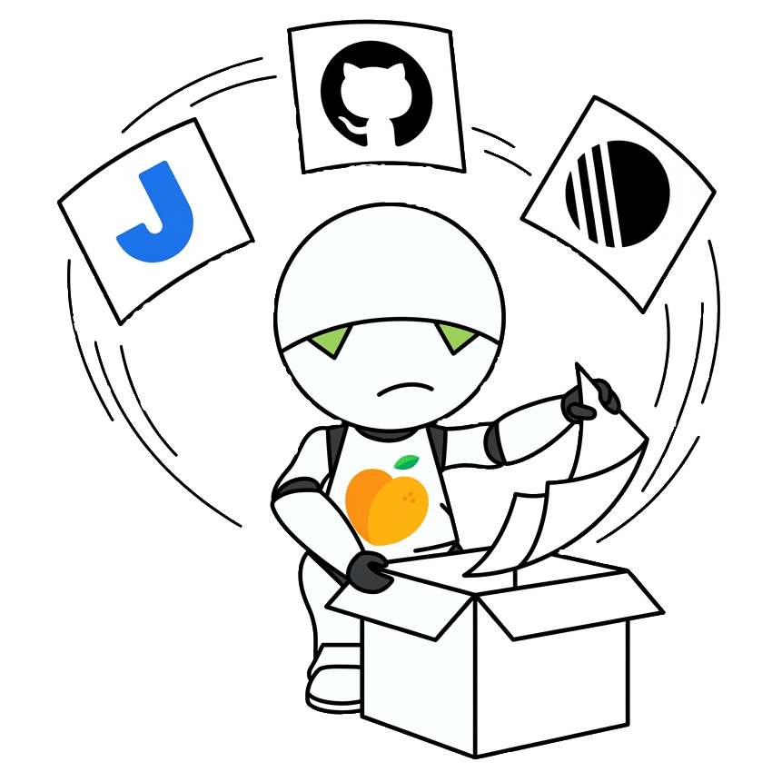

# Marvin

> *"Here I am, brain the size of a planet, and they ask me to review pull requests."*
> — [Marvin the Paranoid Android](https://en.wikipedia.org/wiki/Marvin_the_Paranoid_Android)

Marvin is a GitHub App that automates pull request hygiene. It validates PR titles, descriptions, and Linear issue links; auto-assigns reviewers; updates titles and bodies; and merges PRs — all configurable per repository.

<p align="center">
  
</p>

## Table of contents

- [Features](#features)
- [Prerequisites](#prerequisites)
- [GitHub App setup](#github-app-setup)
- [Configuration](#configuration)
- [PR body format](#pr-body-format)
- [Feature reference](#feature-reference)
- [Local development](#local-development)
- [Deployment](#deployment)

---

## Features

Every feature is opt-in and enabled per repository via the `MARVIN_REPOSITORIES` env var. Features are disabled by default.

| Feature | Description |
|---------|-------------|
| `auto_assignee` | Assigns the PR opener as assignee if none is set |
| `auto_review_assign` | Requests reviewers from a configured team when the *Ready for review* label is added |
| `auto_approve` | Adds the *Approved* label and removes *Ready for review* once enough approvals are in |
| `auto_changes_required` | Adds the *Changes required* label and notifies via Slack when a review requests changes |
| `auto_merge` | Merges the PR (squash) when the *Merge 🚀* label is added and all checks pass |
| `update_title` | Corrects the PR title format (adds missing issue ID prefix, strips GitHub-generated noise) |
| `update_linear_link` | Auto-fills the *Fixed issues* section from the git branch name if it's empty |
| `check_title` | Validates that the title starts with `ISSUE-ID:` |
| `check_description` | Validates that the description is composed only of bullet points |
| `check_time_spent` | Validates that the *Time spent* section contains a valid float (e.g. `1.5 hours`) |
| `check_linear_link` | Validates that a Linear issue URL is present and consistent with the title |
| `check_linear_project` | Validates that the linked Linear issue belongs to a project |
| `check_changelog` | Validates that `CHANGELOG.md` was updated and references the PR number |
| `slack_notify` | Sends a Slack DM to the reviewer when they are requested |
| `auto_cap_report` | On merge, creates a Jira task from the Linear issue for capitalization tracking |

---

## Prerequisites

- Go 1.26+ (to build from source)
- A GitHub App (see [GitHub App setup](#github-app-setup))
- A [Linear](https://linear.app) workspace with an OAuth token *(required for Linear features)*
- A Slack bot token *(required for Slack notifications)*
- A Jira instance *(required for `auto_cap_report`)*

---

## GitHub App setup

1. Go to **Settings → Developer settings → GitHub Apps → New GitHub App** (or your organization's equivalent).

2. Fill in the basics:
   - **GitHub App name**: `marvin` (or any name you like)
   - **Homepage URL**: your repo URL
   - **Webhook URL**: the URL where Marvin is running, e.g. `https://marvin.example.com/webhook`
   - **Webhook secret**: generate a random string, save it as `GH_WEBHOOK_SECRET`

3. **Permissions** — set these to *Read & write*:
   - Repository: `Checks`, `Contents`, `Issues`, `Pull requests`
   - Repository: `Members` → *Read-only*

4. **Subscribe to events**:
   - `Check run`
   - `Pull request`
   - `Pull request review`

5. Generate a **private key** (downloaded as a `.pem` file). This is your `GH_SECRET_KEY`.

6. After creation, note the **App ID** from the General settings page → `GH_APP_ID`.

7. Install the app on your organization/repositories. The **Installation ID** can be found in the webhook payload (`installation.id`) or in the app's **Advanced** tab under recent deliveries → `GH_INSTALL_ID`.

---

## Slack App setup

1. Go to https://api.slack.com/apps → **Create New App**.

2. Use the **From Manifest** option and paste this manifest:

```json
{
    "display_information": {
        "name": "Marvin",
        "description": "Productivity bot to help tech employees",
        "background_color": "#383738",
        "long_description": "Marvin is an automation bot. He takes care of Github PRs and makes sure engineers are following standard format. He also notifies people on Slack when they have work to do."
    },
    "features": {
        "bot_user": {
            "display_name": "Marvin",
            "always_online": false
        }
    },
    "oauth_config": {
        "scopes": {
            "bot": [
                "calls:write",
                "im:write",
                "incoming-webhook"
            ]
        },
        "pkce_enabled": false
    },
    "settings": {
        "org_deploy_enabled": false,
        "socket_mode_enabled": false,
        "token_rotation_enabled": false
    }
}
```

3. Install the app to your workspace and grab the **Bot User OAuth Token** → `MARVIN_SLACK_BOT_TOKEN`.

---

## Linear App setup

1. Go to https://linear.app/settings/api → **Create OAuth app**.

2. Fill in the form:
   - **Name**: `Marvin` (or any name you like)
   - **Callback URL**: `https://your-marvin-url.com/linear/callback`

3. Once created, create a Developer Token for the app → `LINEAR_OAUTH_TOKEN`.

## Configuration

Marvin is configured entirely through environment variables. Copy `config/local/marvin.env` as a starting point.

### GitHub (required)

| Variable | Description | Example |
|----------|-------------|---------|
| `GH_APP_ID` | GitHub App ID | `12345678` |
| `GH_INSTALL_ID` | GitHub App installation ID | `87654321` |
| `GH_SECRET_KEY` | Path to the `.pem` private key file | `/app/secrets/gh-key/latest.pem` |
| `GH_WEBHOOK_SECRET` | Webhook secret used to verify payloads | `s3cr3t` |

### Marvin (required)

| Variable | Description | Example |
|----------|-------------|---------|
| `MARVIN_REPOSITORIES` | Comma-separated list of `repo:feature1;feature2` | `my-repo:auto_merge;check_title,other-repo:slack_notify` |
| `MARVIN_REVIEWERS_TEAMS` | Comma-separated `repo:team-slug` for `auto_review_assign` | `my-repo:backend` |
| `MARVIN_GITHUB_TO_SLACK` | Comma-separated `github-handle:slack-user-id` for Slack DMs | `octocat:U012345678` |

### Linear (required for Linear features)

| Variable | Description | Example |
|----------|-------------|---------|
| `LINEAR_OAUTH_TOKEN` | Linear personal API key | `lin_api_...` |
| `LINEAR_WORKSPACE_SLUG` | Workspace slug visible in Linear issue URLs | `my-company` |
| `LINEAR_ISSUE_PREFIXES` | Comma-separated list of issue prefix shorthands | `ENG,APP,BUG` |

### Slack (required for `slack_notify` / `auto_changes_required`)

| Variable | Description | Example |
|----------|-------------|---------|
| `MARVIN_SLACK_BOT_TOKEN` | Slack bot OAuth token | `xoxb-...` |

### Jira (required for `auto_cap_report`)

| Variable | Description |
|----------|-------------|
| `JIRA_HOST` | Jira instance base URL, e.g. `https://yourorg.atlassian.net` |
| `JIRA_API_KEY` | Base64-encoded `email:api-token` string |
| `JIRA_FIELDS` | Comma-separated key-value pairs for project and field IDs (see below) |

`JIRA_FIELDS` keys:

| Key | Where to find it |
|-----|-----------------|
| `ProjectKey` | `GET <JIRA_HOST>/rest/api/latest/project` |
| `ProjectID` | Same endpoint |
| `TaskIssueTypeID` | `GET <JIRA_HOST>/rest/api/latest/issuetype` |
| `EpicIssueTypeID` | Same endpoint |
| `StartDateCustomFieldKey` | `GET <JIRA_HOST>/rest/api/latest/field` — look for `"name": "Start Date"` |
| `InProgressTransitionID` | `GET <JIRA_HOST>/rest/api/latest/issue/<KEY>/transitions` |
| `DoneTransitionID` | Same endpoint |

---

## PR body format

When using validation features (`check_description`, `check_time_spent`, `check_linear_link`), Marvin expects PR bodies to contain specific sections. Use this template:

```markdown
## Description
- First thing done
- Second thing done

## Time spent
1.5 hours

## Fixed issues
https://linear.app/your-workspace/issue/ENG-123
```

**Rules:**
- `## Description` — must contain only bullet points (`-`, `*`, or `+`). Checkboxes are allowed and will be stripped before the commit message.
- `## Time spent` — must contain a number followed by `hour` or `hours` (e.g. `1 hour`, `2.5 hours`, `1,5 hours`).
- `## Fixed issues` — must contain a valid Linear issue URL matching your configured `LINEAR_WORKSPACE_SLUG` and `LINEAR_ISSUE_PREFIXES`.

---

## Feature reference

### `auto_merge`

Merges the PR using squash when the **Merge 🚀** label is added. Waits for all status checks to pass.

- The commit title = the PR title
- The commit body = bullet points from the `## Description` section
- The PR number is appended to the commit

The PR must have no labels other than `dependencies`, `hotfix`, and `Merge 🚀` to be merged.

### `auto_review_assign`

When the **Ready for review 👌** label is added, Marvin picks reviewers from the configured team (see `MARVIN_REVIEWERS_TEAMS`). The algorithm assigns people with the smallest current review load (load = total additions across open PRs assigned to them).

### `update_linear_link`

If the `## Fixed issues` section is empty or missing a Linear URL, Marvin extracts the issue ID from the branch name (e.g. `feature/eng-123-my-feature` → `ENG-123`) and fills in the section automatically.

### `update_title`

Corrects the PR title to the `ISSUE-ID: description` format. Also removes the noise GitHub adds from the branch name (e.g. `ENG-42: Feature/eng 42 my title` → `ENG-42: my title`).

### `check_linear_project`

Queries Linear to verify that the linked issue belongs to a project. Useful for enforcing that work is always tracked in a project.

### `auto_cap_report`

On PR merge, queries Linear for the issue, then creates a Jira task for capitalization tracking. Requires both Linear and Jira to be configured.

---

## Local development

### Setup

```bash
cp config/local/marvin.env .env
# Fill in your values
```

### Run

```bash
go run ./cmd/marvin
```

### Test

```bash
make test
```

### Regenerate mocks

```bash
make mockgen
```

### Sending webhook payloads locally

The webhook signature check is disabled when `IS_DEV_ENV=true`. You can grab real payloads from your GitHub App's **Advanced** page (under recent deliveries), then replay them:

```bash
curl -X POST http://localhost:8080/webhook \
  -H "Content-Type: application/json" \
  -H "X-GitHub-Event: pull_request" \
  -d @payload.json
```

---

## Deployment

A pre-built Docker image is published to GitHub Container Registry on every merge to `main`:

```bash
docker pull ghcr.io/flashgap/marvin:latest
```

The `deploy/` directory contains a Cloud Run deployment template. You will need to adapt the service account, VPC connector, and secret names to your own GCP project.

The app is configured entirely through environment variables — any container platform (Cloud Run, Fly.io, Railway, etc.) works.

## Configuration

If you want to make use of the labels to control the flow of a PR, make sure to create them in your repository:

```bash
jq -c '.[]' labels.json | while read -r label; do
  gh api \
    --method POST \
    -H "Accept: application/vnd.github+json" \
    -H "X-GitHub-Api-Version: 2026-03-10" \
    /repos/OWNER/REPO/labels \
    -f "name=$(echo "$label" | jq -r '.name')" \
    -f "description=$(echo "$label" | jq -r '.description')" \
    -f "color=$(echo "$label" | jq -r '.color')" \
    > /dev/null
done
```