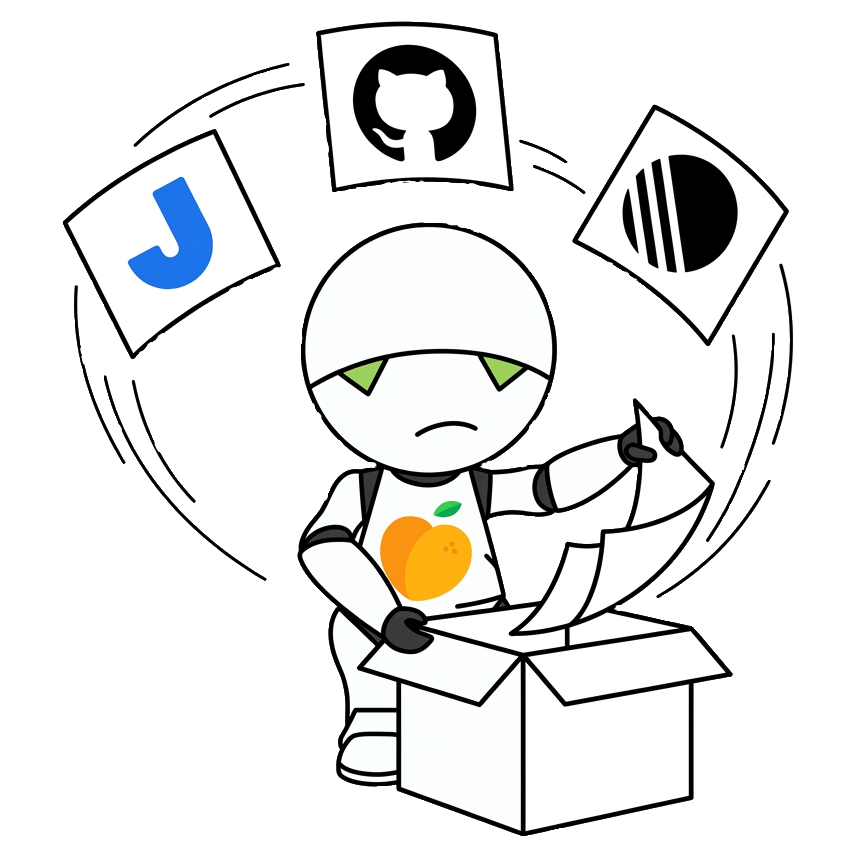

# Marvin

> *"Here I am, brain the size of a planet, and they ask me to review pull requests."*
> — [Marvin the Paranoid Android](https://en.wikipedia.org/wiki/Marvin_the_Paranoid_Android)

Marvin is a GitHub App that automates pull request hygiene. It validates PR titles, descriptions, and Linear issue links; auto-assigns reviewers; updates titles and bodies; and merges PRs — all configurable per repository.

<p align="center">
  
</p>

## Table of contents

- [Features](#features)
- [Prerequisites](#prerequisites)
- [GitHub App setup](#github-app-setup)
- [Configuration](#configuration)
- [Repository configuration (`.marvin.yaml`)](#repository-configuration-marvinyaml)
- [PR body format](#pr-body-format)
- [Feature reference](#feature-reference)
- [Local development](#local-development)
- [Deployment](#deployment)

---

## Features

Every feature is opt-in and enabled per repository via that repository's own `.marvin.yaml` file (see
[Repository configuration](#repository-configuration-marvinyaml)). Features are disabled by default,
and a repository with no `.marvin.yaml` has Marvin fully disabled on it.

| Feature | Description |
|---------|-------------|
| `auto_assignee` | Assigns the PR opener as assignee if none is set |
| `auto_draft_labels` | Automatically manages *Work in progress* and *Ready for review* labels based on GitHub draft state |
| `auto_review_assign` | Requests reviewers from a configured team when the *Ready for review* label is added |
| `auto_approve` | Adds the *Approved* label and removes *Ready for review* once enough approvals are in |
| `auto_changes_required` | Adds the *Changes required* label and notifies via Slack when a review requests changes; removes it and re-requests the affected human reviewers when *Ready for review* is re-applied |
| `require_ai_review` | Blocks `auto_review_assign` until a recognized AI reviewer (CodeRabbit, Graphite, etc.) has reviewed the PR at least once, or reported completion via a success commit status; reverts to *Work in progress* and comments if triggered early |
| `auto_merge` | Merges the PR (squash) when the *Merge 🚀* label is added and all checks pass |
| `update_title` | Corrects the PR title format (adds missing issue ID prefix, strips GitHub-generated noise) |
| `update_linear_link` | Auto-fills the *Fixed issues* section from the git branch name if it's empty |
| `check_title` | Validates that the title starts with `ISSUE-ID:` |
| `check_description` | Validates that the description is composed only of bullet points |
| `check_time_spent` | Validates that the *Time spent* section contains a valid float (e.g. `1.5 hours`) |
| `check_linear_link` | Validates that a Linear issue URL is present and consistent with the title |
| `check_linear_project` | Validates that the linked Linear issue belongs to a project |
| `check_changelog` | Validates that `CHANGELOG.md` was updated and references the PR number |
| `slack_notify` | Sends a Slack DM to the reviewer when they are requested |
| `auto_cap_report` | On merge, creates a Jira task from the Linear issue for capitalization tracking |

---

## Prerequisites

- Go 1.26+ (to build from source)
- A GitHub App (see [GitHub App setup](#github-app-setup))
- A [Linear](https://linear.app) workspace with an OAuth token *(required for Linear features)*
- A Slack bot token *(required for Slack notifications)*
- A Jira instance *(required for `auto_cap_report`)*

---

## GitHub App setup

1. Go to **Settings → Developer settings → GitHub Apps → New GitHub App** (or your organization's equivalent).

2. Fill in the basics:
   - **GitHub App name**: `marvin` (or any name you like)
   - **Homepage URL**: your repo URL
   - **Webhook URL**: the URL where Marvin is running, e.g. `https://marvin.example.com/webhook`
   - **Webhook secret**: generate a random string, save it as `GH_WEBHOOK_SECRET`

3. **Permissions** — set these to *Read & write*:
   - Repository: `Checks`, `Contents`, `Issues`, `Pull requests`
   - Repository: `Members` → *Read-only*

4. **Subscribe to events**:
   - `Check run`
   - `Pull request`
   - `Pull request review`

5. Generate a **private key** (downloaded as a `.pem` file). This is your `GH_SECRET_KEY`.

6. After creation, note the **App ID** from the General settings page → `GH_APP_ID`.

7. Install the app on your organization/repositories. The **Installation ID** can be found in the webhook payload (`installation.id`) or in the app's **Advanced** tab under recent deliveries → `GH_INSTALL_ID`.

---

## Slack App setup

1. Go to https://api.slack.com/apps → **Create New App**.

2. Use the **From Manifest** option and paste this manifest:

```json
{
    "display_information": {
        "name": "Marvin",
        "description": "Productivity bot to help tech employees",
        "background_color": "#383738",
        "long_description": "Marvin is an automation bot. He takes care of Github PRs and makes sure engineers are following standard format. He also notifies people on Slack when they have work to do."
    },
    "features": {
        "bot_user": {
            "display_name": "Marvin",
            "always_online": false
        }
    },
    "oauth_config": {
        "scopes": {
            "bot": [
                "calls:write",
                "im:write",
                "incoming-webhook"
            ]
        },
        "pkce_enabled": false
    },
    "settings": {
        "org_deploy_enabled": false,
        "socket_mode_enabled": false,
        "token_rotation_enabled": false
    }
}
```

3. Install the app to your workspace and grab the **Bot User OAuth Token** → `MARVIN_SLACK_BOT_TOKEN`.

---

## Linear App setup

1. Go to https://linear.app/settings/api → **Create OAuth app**.

2. Fill in the form:
   - **Name**: `Marvin` (or any name you like)
   - **Callback URL**: `https://your-marvin-url.com/linear/callback`

3. Once created, create a Developer Token for the app → `LINEAR_OAUTH_TOKEN`.

## Configuration

The Marvin service itself (credentials, org-wide settings) is configured through environment
variables — copy `config/local/marvin.env` as a starting point. Per-repository settings (which
features are on, who reviews what) live in each repo's own `.marvin.yaml` instead; see
[Repository configuration](#repository-configuration-marvinyaml).

### GitHub (required)

| Variable | Description | Example |
|----------|-------------|---------|
| `GH_APP_ID` | GitHub App ID | `12345678` |
| `GH_INSTALL_ID` | GitHub App installation ID | `87654321` |
| `GH_SECRET_KEY` | Path to the `.pem` private key file | `/app/secrets/gh-key/latest.pem` |
| `GH_WEBHOOK_SECRET` | Webhook secret used to verify payloads | `s3cr3t` |

### Marvin (org-wide, optional)

These apply across every repository Marvin is installed on. Per-repository settings — which
features are on, who reviews what — live in each repo's own `.marvin.yaml` instead; see
[Repository configuration](#repository-configuration-marvinyaml).

| Variable | Description | Example |
|----------|-------------|---------|
| `MARVIN_GITHUB_TO_SLACK` | Comma-separated `github-handle:slack-user-id` for Slack DMs | `octocat:U012345678` |
| `MARVIN_AI_REVIEWER_LOGINS` | Comma-separated extra AI-reviewer bot logins recognized by `require_ai_review` and `auto_changes_required`, in addition to the built-in `coderabbitai[bot]`/`graphite-app[bot]`/`copilot-pull-request-reviewer[bot]` (exact, case-insensitive match). Repos can add their own via `.marvin.yaml`'s `ai_review.reviewer_logins`. | `my-custom-ai-bot[bot]` |
| `MARVIN_AI_REVIEW_STATUS_CONTEXTS` | Comma-separated extra commit-status contexts accepted by `require_ai_review` as a completed AI review when no formal review is found, in addition to the built-in `CodeRabbit` (exact, case-insensitive match on the current HEAD). Repos can add their own via `.marvin.yaml`'s `ai_review.status_contexts`. | `MyAIReviewer` |
| `MARVIN_REPO_CONFIG_CACHE_TTL` | How long a repository's `.marvin.yaml` is cached before being re-fetched from its default branch | `5m` (default) |

### Linear (required for Linear features)

| Variable | Description | Example |
|----------|-------------|---------|
| `LINEAR_OAUTH_TOKEN` | Linear personal API key | `lin_api_...` |
| `LINEAR_WORKSPACE_SLUG` | Workspace slug visible in Linear issue URLs | `my-company` |
| `LINEAR_ISSUE_PREFIXES` | Comma-separated list of issue prefix shorthands | `ENG,APP,BUG` |

### Slack (required for `slack_notify` / `auto_changes_required`)

| Variable | Description | Example |
|----------|-------------|---------|
| `MARVIN_SLACK_BOT_TOKEN` | Slack bot OAuth token | `xoxb-...` |

### Jira (required for `auto_cap_report`)

| Variable | Description |
|----------|-------------|
| `JIRA_HOST` | Jira instance base URL, e.g. `https://yourorg.atlassian.net` |
| `JIRA_API_KEY` | Base64-encoded `email:api-token` string |
| `JIRA_FIELDS` | Comma-separated key-value pairs for project and field IDs (see below) |

`JIRA_FIELDS` keys:

| Key | Where to find it |
|-----|-----------------|
| `ProjectKey` | `GET <JIRA_HOST>/rest/api/latest/project` |
| `ProjectID` | Same endpoint |
| `TaskIssueTypeID` | `GET <JIRA_HOST>/rest/api/latest/issuetype` |
| `EpicIssueTypeID` | Same endpoint |
| `StartDateCustomFieldKey` | `GET <JIRA_HOST>/rest/api/latest/field` — look for `"name": "Start Date"` |
| `InProgressTransitionID` | `GET <JIRA_HOST>/rest/api/latest/issue/<KEY>/transitions` |
| `DoneTransitionID` | Same endpoint |

### Database (optional)

Marvin can optionally connect to a SQL database (Postgres or MySQL) for future
long-term memory features. The client is created at startup and disabled when
`DB_HOST` is empty.

| Variable | Description | Default |
|----------|-------------|---------|
| `DB_HOST` | Database host. **Empty disables the database client entirely.** | _(empty)_ |
| `DB_DRIVER` | `postgres` or `mysql`. Required when `DB_HOST` is set. | _(empty)_ |
| `DB_PORT` | Database port. | `5432` (postgres), `3306` (mysql) |
| `DB_USER` | Database user. | _(empty)_ |
| `DB_PASSWORD` | Database password. | _(empty)_ |
| `DB_NAME` | Database name. | _(empty)_ |
| `DB_PARAMS` | Driver-specific params, e.g. `sslmode:disable,connect_timeout:5`. | _(empty)_ |
| `DB_MAX_OPEN_CONNS` | Max open connections. | `25` |
| `DB_MAX_IDLE_CONNS` | Max idle connections. | `5` |
| `DB_CONN_MAX_LIFETIME` | Max connection lifetime. | `30m` |
| `DB_CONN_MAX_IDLE_TIME` | Max connection idle time. | `5m` |

Marvin composes its SQL through [goqu](https://github.com/doug-martin/goqu), so
services build dialect-agnostic query expressions and `pkg/database` renders
them for the configured driver.

#### Migrations (Atlas)

Schema changes live as versioned SQL files under `internal/migrations/<driver>/`,
managed by [Atlas](https://atlasgo.io/). Marvin applies pending migrations at
startup whenever the database is enabled — there is nothing to run manually in
production.

To author a new migration locally:

```bash
# Install the Atlas CLI: https://atlasgo.io/getting-started
make migrate-diff driver=postgres name=add_something
make migrate-diff driver=mysql    name=add_something   # keep both in lockstep
```

The `make migrate-diff` target also re-runs `make migrate-hash`, which
regenerates the `atlas.sum` integrity file in each driver subdirectory.

### Slack `/lock` slash command (optional)

A PwnBot-style game: anyone who finds a colleague's laptop unlocked types
`/lock @theirhandle` from the unlocked laptop. The caller (= the victim, since
the command is being sent from their Slack) loses a point, the mentioned user
(= the finder) gains one. The victim later receives a DM from Marvin telling
them what happened. Calling `/lock` with no argument shows an ephemeral
leaderboard (top 3 / bottom 3).

The endpoint is **gated on the database**: without `DB_HOST`, requests return
`501 Not Implemented`.

**Slack app configuration**
- Add a slash command with the request URL `https://<your-marvin>/marvin/_webhook/slack/lock`.
- Turn on **"Escape channels, users, and links"** — Marvin parses the
  `<@U12345|handle>` form Slack sends with that setting enabled.
- Bot token scopes: `chat:write`, `im:write`, `users:read`.

**Env vars**

| Variable | Description |
|----------|-------------|
| `MARVIN_SLACK_SIGNING_SECRET` | Slack app signing secret used to verify the `X-Slack-Signature` header. Required outside dev. |

---

## Repository configuration (`.marvin.yaml`)

Everything about how Marvin behaves on a specific repository — which features are on, who reviews
what — is declared in a `.marvin.yaml` file committed at the **root of that repository**, on its
**default branch**. There is no central per-repo config on Marvin's side anymore: repo owners
self-serve their own settings via a normal PR to their own repo, without touching Marvin's
deployment.

A repository with no `.marvin.yaml` has Marvin fully disabled on it — no comments, no checks, no
reviewer assignment.

Marvin always reads `.marvin.yaml` off the repository's **default branch**, never off a PR's head
branch. Otherwise a PR author could edit their own review rules inside the very PR being
reviewed (e.g. remove the reviewer requirement) and bypass review. Changes to `.marvin.yaml` take
effect once merged to the default branch, subject to the `MARVIN_REPO_CONFIG_CACHE_TTL` cache
(default `5m`).

```yaml
# .marvin.yaml, at the root of the repository

features:
  - auto_merge
  - auto_review_assign
  - check_changelog
  - require_ai_review

reviewers:
  default_team: platform        # used when no rule below matches a changed file (optional)
  rules:
    - path: "go/**"
      team: backend-team
    - path: "py/**"
      team: data-team

slack_notify: true               # still requires the central MARVIN_GITHUB_TO_SLACK mapping

ai_review:
  reviewer_logins: ["my-custom-ai-bot[bot]"]     # extends the built-in + org-wide defaults, this repo only
  status_contexts: ["MyAIReviewer"]
```

- `features` is the same list of feature names documented in [Features](#features) and
  [Feature reference](#feature-reference) — only where they're declared has changed.
- `reviewers.rules` is a list of glob patterns (`**` supported, e.g. `go/**`, `py/**`) matched
  against every file changed in a PR. When a PR touches files matched by more than one rule,
  Marvin requests reviewers from the **union** of every matched team — this is what makes
  `auto_review_assign` work across a monorepo with per-team subtrees. `reviewers.default_team` is
  used as a fallback when no rule matches any changed file.
- An invalid or unparsable `.marvin.yaml` disables Marvin for that repository (fails closed) rather
  than running with a partial configuration; check the Marvin service logs for the parse error.

---

## PR body format

When using validation features (`check_description`, `check_time_spent`, `check_linear_link`), Marvin expects PR bodies to contain specific sections. Use this template:

```markdown
## Description
- First thing done
- Second thing done

## Time spent
1.5 hours

## Fixed issues
https://linear.app/your-workspace/issue/ENG-123
```

**Rules:**
- `## Description` — must contain only bullet points (`-`, `*`, or `+`). Checkboxes are allowed and will be stripped before the commit message.
- `## Time spent` — must contain a number followed by `hour` or `hours` (e.g. `1 hour`, `2.5 hours`, `1,5 hours`).
- `## Fixed issues` — must contain a valid Linear issue URL matching your configured `LINEAR_WORKSPACE_SLUG` and `LINEAR_ISSUE_PREFIXES`.

---

## Feature reference

### `auto_merge`

Merges the PR using squash when the **Merge 🚀** label is added. Waits for all status checks to pass.

- The commit title = the PR title
- The commit body = bullet points from the `## Description` section
- The PR number is appended to the commit

The PR must have no labels other than `dependencies`, `hotfix`, and `Merge 🚀` to be merged.

### `auto_review_assign`

When the **Ready for review 👌** label is added, Marvin resolves which team(s) should review based
on the `reviewers` block of the repository's [`.marvin.yaml`](#repository-configuration-marvinyaml):
every changed file is matched against `reviewers.rules`, and Marvin pools reviewers from the
union of every matched team, falling back to `reviewers.default_team` when nothing matches. This
is what lets a single monorepo route reviews to different teams per subtree (e.g. `go/**` →
`backend-team`, `py/**` → `data-team`).

Within the resolved team pool, the algorithm assigns people with the smallest current review load
(load = total additions across open PRs assigned to them).
The number of reviewers to assign is derived from the branch's required approving review count —
Marvin supports both classic branch protection rules and repository rulesets.

### `auto_draft_labels`

Automatically manages the **Work in progress ⏳** and **Ready for review 👌** labels based on GitHub's native draft state transitions:

- When a PR is opened as draft or converted to draft → adds **Work in progress ⏳**
- When a PR is converted to draft and already has **Ready for review 👌** → removes **Ready for review 👌**
- When the *Ready for review* button is pressed (draft → ready) → removes **Work in progress ⏳**, adds **Ready for review 👌**, runs PR checks, and triggers `auto_review_assign` if enabled

Non-draft PRs opened normally are not affected by this automation.

### `auto_changes_required`

Manages the *Changes required* label lifecycle:

- When a review requests changes, Marvin adds the *Changes required* label and notifies via Slack (see `slack_notify`).
- When the *Ready for review* label is re-applied while *Changes required* is still present, Marvin removes *Changes required* and re-requests a review from the human reviewers whose latest review requested changes — excluding recognized AI reviewer bots (default: `coderabbitai[bot]`, `graphite-app[bot]`, `copilot-pull-request-reviewer[bot]`, extendable org-wide via `MARVIN_AI_REVIEWER_LOGINS` or per-repo via `.marvin.yaml`'s `ai_review.reviewer_logins`).
- If the repository also has `require_ai_review` and `auto_review_assign` enabled, this swap waits for the AI-review gate to pass first, so a re-request never fires ahead of the AI review check.

### `require_ai_review`

Gates `auto_review_assign` behind AI-reviewer confirmation:

- When the *Ready for review* label is added (manually, or via the native draft → ready transition), Marvin checks whether a recognized AI reviewer bot (default: `coderabbitai[bot]`, `graphite-app[bot]`, `copilot-pull-request-reviewer[bot]`, extendable org-wide via `MARVIN_AI_REVIEWER_LOGINS` or per-repo via `.marvin.yaml`'s `ai_review.reviewer_logins`) has submitted **at least one** review on the PR. The review does not have to be on the current commit — an AI reviewer legitimately skips re-reviewing commits that add no reviewable changes (e.g. base-branch merges), so we rely on the author to re-request a review when needed.
- As a fallback, if no formal review is found, Marvin accepts a **successful commit status** whose context matches a known AI reviewer (default: `CodeRabbit`, extendable org-wide via `MARVIN_AI_REVIEW_STATUS_CONTEXTS` or per-repo via `.marvin.yaml`'s `ai_review.status_contexts`) on the current HEAD. Some reviewers skip submitting a review on trivial/no-op diffs but still publish this completion status.
- If neither is found, Marvin removes *Ready for review*, re-adds *Work in progress*, comments asking the author to request an AI review, and does **not** assign a human reviewer.
- If an AI review (or matching success status) is found, `auto_review_assign` proceeds as normal.

Has no effect unless `auto_review_assign` is also enabled.

### `update_linear_link`

If the `## Fixed issues` section is empty or missing a Linear URL, Marvin extracts the issue ID from the branch name (e.g. `feature/eng-123-my-feature` → `ENG-123`) and fills in the section automatically.

### `update_title`

Corrects the PR title to the `ISSUE-ID: description` format. Also removes the noise GitHub adds from the branch name (e.g. `ENG-42: Feature/eng 42 my title` → `ENG-42: my title`).

### `check_linear_project`

Queries Linear to verify that the linked issue belongs to a project. Useful for enforcing that work is always tracked in a project.

### `auto_cap_report`

On PR merge, queries Linear for the issue, then creates a Jira task for capitalization tracking. Requires both Linear and Jira to be configured.

---

## Local development

### Setup

```bash
cp config/local/marvin.env .env
# Fill in your values
```

### Run

```bash
go run ./cmd/marvin
```

### Test

```bash
make test
```

### Regenerate mocks

```bash
make mockgen
```

### Sending webhook payloads locally

The webhook signature check is disabled when `IS_DEV_ENV=true`. You can grab real payloads from your GitHub App's **Advanced** page (under recent deliveries), then replay them:

```bash
curl -X POST http://localhost:8080/webhook \
  -H "Content-Type: application/json" \
  -H "X-GitHub-Event: pull_request" \
  -d @payload.json
```

---

## Deployment

A pre-built Docker image is published to GitHub Container Registry on every merge to `main`:

```bash
docker pull ghcr.io/flashgap/marvin:latest
```

The `deploy/` directory contains a Cloud Run deployment template. You will need to adapt the service account, VPC connector, and secret names to your own GCP project.

The app is configured entirely through environment variables — any container platform (Cloud Run, Fly.io, Railway, etc.) works.

## Configuration

If you want to make use of the labels to control the flow of a PR, make sure to create them in your repository:

```bash
jq -c '.[]' labels.json | while read -r label; do
  gh api \
    --method POST \
    -H "Accept: application/vnd.github+json" \
    -H "X-GitHub-Api-Version: 2026-03-10" \
    /repos/OWNER/REPO/labels \
    -f "name=$(echo "$label" | jq -r '.name')" \
    -f "description=$(echo "$label" | jq -r '.description')" \
    -f "color=$(echo "$label" | jq -r '.color')" \
    > /dev/null
done
```